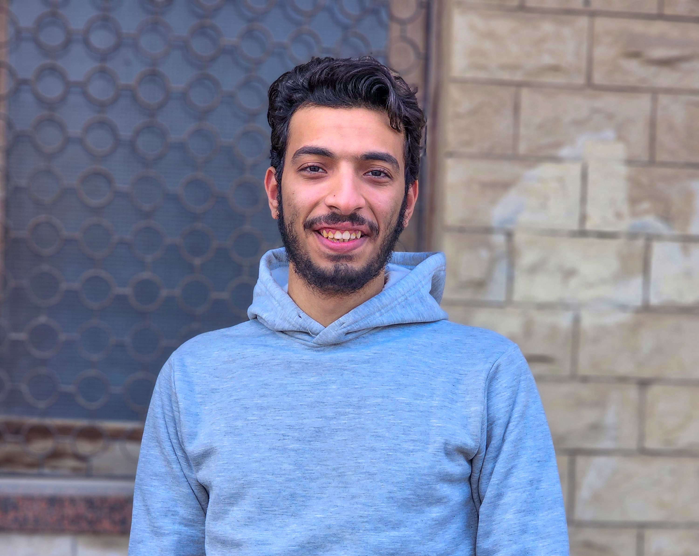

# Abdel-Rahman Abdel-Monsef Mohammed

  

---

## Contact Information
* **Mobile:** [+201272862660](tel:+201272862660) | [+201020708385](tel:+201020708385)
* **LinkedIn:** [Abdelrhman Abdelmonsef](https://www.linkedin.com/in/abdelrhman-abdelmonsef-48aa281ab/)
* **GitHub:** [abdelrhmanabdelmonsef](https://github.com/abdelrhmanabdelmonsef)
* **Email:** [abdelmonsef349@gmail.com](mailto:abdelmonsef349@gmail.com) | [abdelmonsef348@gmail.com](mailto:abdelmonsef348@gmail.com)

---

## Summary
Highly motivated **Computers and Systems Engineering graduate** with hands-on experience in **Web Application Penetration Testing** and a robust foundation in networking, operating systems, and scripting. Proven track record of identifying vulnerabilities and performing secure code analysis during a dedicated cybersecurity internship. Active student leader and technical speaker, currently training for advanced certifications including the **OSCP** and **eWAPT**. Exceptional problem-solver who thrives in fast-paced, high-pressure environments.

---

## Education
* **Bachelor of Science in Computers and Systems Engineering**
  * *Institution:* Al-Azhar University, Faculty of Computers and Systems Engineering
  * *Duration:* October 2019 – June 2024
  * *Cumulative Grade:* Very Good (Grade A Equivalent) | [Graduation Certificate](../legacy/certificates/graduation_cert.pdf)

---

## Technical Skills & Tools
* **Web Security:** Penetration Testing, OWASP Top 10, Reconnaissance, Port Scanning, Host Discovery, Service Enumeration
* **Tools:** Nmap, Burp Suite, Metasploit, OWASP ZAP, Wireshark, Dirbuster
* **Operating Systems:** Linux (Red Hat / Kali Linux / Debian), Windows (Server & Client)
* **Networking:** TCP/IP Protocols, Network Routing & Switching, Network Security Architecture
* **Programming & Scripting:** Python, Bash, Java, JavaScript, SQL (MySQL)

---

## Work Experience
### Penetration Tester Intern
**Hackers For You** | *Feb 2, 2024 - May 5, 2024* | [Internship Certificate](../legacy/certificates/Hackers_For_you_intern_cert.png)
* Collaborated with senior penetration testers to perform comprehensive security assessments and web application/network penetration tests.
* Executed targeted reconnaissance, vulnerability scanning, and manual exploitation of flaws to secure applications against OWASP Top 10 vulnerabilities.
* Analyzed test results, drafted detailed technical remediation reports, and presented actionable security recommendations to developers.
* Participated in continuous training and threat modeling sessions to align security controls with modern cybersecurity best practices.

---

## Certifications & Training
1. **Red Hat System Administration I** | [Certificate](../legacy/certificates/mlang_enCourse_Certificate_Enmlangmlang_ar___mlang.pdf)
2. **Google Cybersecurity Professional Certificate**
   * *Foundations of Cybersecurity* | [Certificate](../legacy/certificates/Coursera%2062QY3G5YL8MZ.pdf)
   * *Play It Safe: Manage Security Risks* | [Certificate](../legacy/certificates/Coursera%20M7NZDA9943MN.pdf)
   * *Connect and Protect: Networks and Network Security* | [Certificate](../legacy/certificates/Coursera%20M4T8D89EFANG.pdf)
   * *Tools of the Trade: Linux and SQL* | [Certificate](../legacy/certificates/Coursera%20VKAPSSTPLL5W.pdf)
3. **Professional Development Training:** McKinsey Forward Program *(Focus on adaptability, problem-solving, and team leadership)*

---

## Volunteer & Leadership Experience
* **Vice-Head, Cybersecurity Team** | *Google Developer Student Clubs (GDSC), Al-Azhar University*
  * Coordinated, planned, and delivered high-quality cybersecurity workshops, CTF training, and events for 150+ students.
* **Vice-Head, Cybersecurity Team** | *AZ-SEnCS, Al-Azhar University*
  * Designed practical security curricula for university students and assisted in organizing academic cybersecurity bootcamps.
* **Member, Java Development Team** | *AZ-SEnCS, Al-Azhar University*
  * Partnered with peers to build and optimize Java-based applications, incorporating object-oriented design and clean coding principles.

---

## Languages
* **Arabic:** Native Speaker
* **English:** Professional Working Proficiency (Level 7 / CEFR B1.3)
